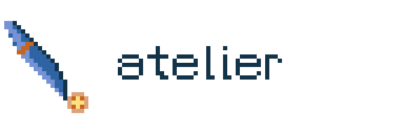
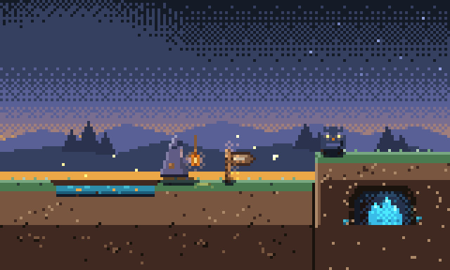
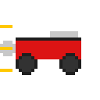
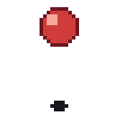

<p align="center">
  <picture>
    <source media="(prefers-color-scheme: dark)" srcset="site/assets/logo-wordmark-dark.png">
    
  </picture>
</p>

<p align="center"><strong>The pixel-art studio agents can see.</strong><br>
Layered, animated, game-ready art — over MCP.</p>

<p align="center">
  <a href="https://github.com/marmikshah/atelier/actions/workflows/ci.yml"></a>
  <a href="https://github.com/marmikshah/atelier/releases/latest"></a>
  <a href="LICENSE"></a>
  
</p>

<p align="center">
  
</p>

<p align="center">
  
  
  
  
  
  
</p>

<p align="center"><em>Not one pixel was hand-placed. Every frame is a tool call.<br>
<a href="https://marmikshah.github.io/atelier/">See all four models draw the same eight tasks →</a></em></p>

---

## Install

```sh
curl -fsSL https://marmikshah.github.io/atelier/install.sh | sh
```

Sets up the background daemon and prints the one line that registers it with your
MCP client. Restart the client, then just ask:

> *"draw me a blinking cat sprite and export it as a GIF"*

<p align="center">
  <code>doc_create</code> → <code>paint</code> → <b><code>doc_look</code></b> → <i>fix</i> → <code>doc_export</code>
</p>

<table>
<tr><td><b>Docker</b></td><td><code>docker run -d -p 8765:8765 -v atelier-data:/data ghcr.io/marmikshah/atelier</code></td></tr>
<tr><td><b>Binaries</b></td><td>macOS&nbsp;(ARM), Linux&nbsp;x86_64, Windows — <a href="https://github.com/marmikshah/atelier/releases/latest">latest release</a></td></tr>
<tr><td><b>Source</b></td><td><code>cargo install --path .</code> · or <code>./install.sh --source</code></td></tr>
</table>

## Why it's different

Agents are good at *describing* art and bad at *seeing* it. So most AI pixel art
is drawn blind — the model guesses, never looks, and ships the guess.

**atelier gives the agent an eye.** `doc_look` hands back the actual frame as an
image, plus measured stats. The agent looks at its own work, judges it, and fixes
it — the same loop a human uses in an editor. Every other tool returns text only,
so looking is a deliberate act, not an accident.

|  |  |
|---|---|
| 🎨 **A real editor, headless** | Layers, frames, tags, selections, locked palettes. Generators for figures, walk cycles, autotile terrain, 9-slice panels, particle FX. |
| 👁 **An eye, not just a hand** | Critique, palette, silhouette, animation and colour-blindness audits turn *"does it look right?"* into numbers an agent can act on. |
| 🎮 **Game-ready out of the box** | Spritesheets with pivots/hitboxes/tags, GIF/APNG, texture atlases, Tiled tilesets, engine-standard JSON. |
| 🔒 **Yours, offline** | One static Rust binary. No API keys, no network, no telemetry. Fully deterministic. |

## The CLI

```sh
atelier                    # stdio MCP server (your client spawns it)
atelier --http             # HTTP server at 127.0.0.1:8765/mcp
atelier install            # background daemon (launchd / systemd)
atelier tools              # list the tool surface
atelier library            # what's in your document store
atelier replay recipe.json # replay a recorded session, byte-identically
```

**Tool profile** — 20 tools by default, the set an agent actually reaches for.
`ATELIER_PROFILE=full` opens all 63. Every tool executes either way; the profile
only changes what's advertised.

## Art is a recipe

Every document is an ordered sequence of tool calls, so a piece of art *is* a
replayable program — one that renders byte-identically anywhere:

```sh
atelier replay docs/examples/invader-march.json --home /tmp/demo
```

The recipes in [docs/examples](docs/examples) are both the brand art and the
integration tests.

## Documentation

| | |
|---|---|
| 🖼 **[Benchmark gallery](https://marmikshah.github.io/atelier/)** | Four models, eight tasks, identical prompts — compared side by side |
| 🧭 **[Architecture tour](https://marmikshah.github.io/atelier/architecture.html)** | The crate tower and the life of a tool call, illustrated |
| 🔧 **[Tool reference](https://marmikshah.github.io/atelier/tools.html)** | All 63 tools, generated from the live registry |
| 📓 **[CHANGELOG](CHANGELOG.md)** | What changed, and what broke |

## A personal note

atelier began as one question: can AI agents, using only tool calls, make art
that's genuinely good enough to ship in a game?

**100% of this code was written by AI.** Not assisted — written. Claude Opus 4.8
and Fable 5 did the heavy lifting, with Kimi 2.6 and Minimax 2.7 pitching in. I
have not written a single line. My part was direction: holding the project to the
same standards I use where I *do* still write the code.

It's an ongoing experiment. I'll keep running the benchmark against other model
families and trying designs to see how each one holds a brush.

If atelier helps you — as a tool, a reference, or a kick-start on your own game —
that makes me genuinely happy. The tokens are already spent; the least they can do
is be useful to you too.

> [!WARNING]
> **Below 2.0.0, this code has not been reviewed by a human.** It's AI-generated,
> diffs are large, and every release below 2.0.0 will likely contain breaking
> changes despite my best intentions — assume bugs and security issues I haven't
> caught. **Use at your own risk.**
>
> **2.0.0 is the milestone where I start reviewing the code in detail** and
> contributing directly. It will be tagged by hand — the one release an AI agent
> is not allowed to cut.

## Contributing

Not accepting external code contributions until **v2.0.0** — pull requests are
closed automatically until then. Bug reports and ideas are very welcome as
[issues](https://github.com/marmikshah/atelier/issues).

[Contributing](.github/CONTRIBUTING.md) · [Code of Conduct](.github/CODE_OF_CONDUCT.md) · [Security](.github/SECURITY.md)

## License

[MIT](LICENSE) © Marmik Shah
