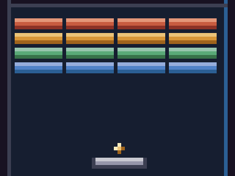
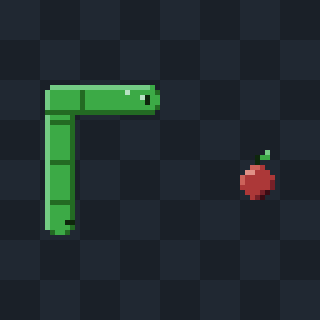
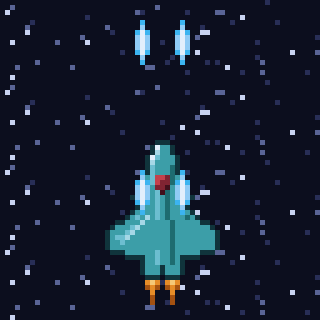
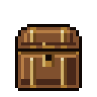
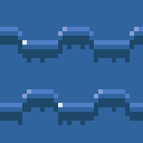

# atelier

A **headless pixel-art studio, exposed as an MCP server** — Aseprite-as-API for
agents. Written in **Rust** (single static binary, no runtime). An agent creates
a layered, animated **document**, paints it with drawing primitives, renders a
PNG **preview** to *look* at the canvas, and iterates — the same look-and-fix
loop a human uses in an editor. Pure code: no API keys, no network dependency,
deterministic. Engine-agnostic PNG / spritesheet / GIF output.

<p align="center">
  
</p>

<p align="center">
  
  
  
</p>
<p align="center">
  
  
</p>

<p align="center"><em>Every pixel in this README — the scene, the sprites, the
animations — was drawn and animated by agents through the MCP tools. No
hand-editing, no image imports: primitives, procedural paint, and the
analysis tools as a second pair of eyes.</em></p>

<p align="center">
  
  
  
  
  
</p>
<p align="center">
  
  
  
  
  
  
  
</p>

## Why

Agents are good at *describing* art and bad at *seeing* it. atelier closes the
loop: every drawing op is a tool call, and `doc_render` hands back a PNG the
agent can actually look at, judge, and correct. That turns pixel art from
one-shot generation into **iterative craftsmanship** — draw, render, inspect,
fix — with deterministic, versionable results (a document is JSON + PNG cels on
disk, not latent noise).

- **Game-ready output** — spritesheets with frame rects/durations/tags/pivots,
  animated GIFs, a packed texture atlas. Any engine can slice it.
- **Real editor features** — layers with 14 blend modes, frames + tags,
  selections/masks, clipboard across documents, palettes, onion-skinning.
- **Procedural leverage** — gradients with ordered dithering, fBm/perlin/voronoi
  noise, scatter, Bézier strokes, symmetry, drop shadow/glow/bevel — the agent
  composes effects instead of placing every pixel.

## Model

- A **document** is the unit (think one `.ase` file): a canvas of ordered
  **layers** (opacity / visibility / blend, source-over composite) over a
  timeline of **frames** (each with a duration), plus animation **tags** (named
  frame ranges). A **cel** is one layer×frame image. Documents are stored under
  `~/.atelier/documents/<id>/` (override the root with `ATELIER_HOME`) and
  addressed by `id`. No projects, no baked-in art style — the agent draws
  everything.
- The loop: `doc_create` → paint (`doc_*`) → `doc_render` (flatten a frame to a
  PNG you can SEE) → inspect → fix → `doc_export_sheet` / `doc_export_gif`.

## MCP tools

**Library**
- `doc_create` — new layered/animated document (name, width, height) → `id`.
- `list_docs` — all documents (id, name, size, frame/layer counts).
- `doc_info` — a document's full structure (layers, frames, cels, tags).
- `delete_doc` — remove a document and its files.
- `export_all` — export every document as a spritesheet PNG (+ JSON meta) into a
  flat target dir for a game's `assets/`.

**Structure & timeline**
- `doc_add_layer` / `doc_set_layer` — stack layers; toggle visibility / opacity /
  blend mode: `normal` · `multiply` · `screen` · `add` · `overlay` · `soft-light`
  · `hard-light` · `darken` · `lighten` · `color-dodge` · `color-burn` ·
  `difference` · `subtract` · `exclusion`. Real lighting: `multiply` for
  shadow/AO, `add`/`screen` for light/glow/bloom, `overlay`/`soft-light` to grade.
- `doc_add_frame` (optionally `copy_from` an existing frame) /
  `doc_set_frame_duration`.
- `doc_tween` — insert N cross-faded in-between frames between two poses
  (dissolve), reindexing later cels.
- `doc_add_tag` — named frame range (`forward` / `reverse` / `pingpong`).
- `doc_set_pivot` — set a frame's anchor point `[x,y]` (feet, weapon mount); the
  engine reads it to position the sprite. Emitted (scaled) in sheet/atlas JSON.
- `doc_keyframe_move` — eased multi-frame region motion: take a region from one
  frame and stamp it across following frames along an interpolated offset
  (`linear` / `ease-in` / `ease-out` / `ease-in-out`). A jump arc is two calls
  (rise ease-out, fall ease-in) — motion as structure, no redrawing.

**Drawing** (coords are document pixels; color is `[r,g,b]` or `[r,g,b,a]`,
alpha `0` erases)
- `doc_pencil` · `doc_line` · `doc_rect` · `doc_ellipse` (filled or clean closed
  outline; `rx==ry` ⇒ circle) · `doc_fill` (bucket) · `doc_outline` ·
  `doc_fill_cel` · `doc_clear_cel`
- `doc_polygon` — vertices `[[x,y],...]`; `fill` scanline-fills the interior,
  else draws the closed outline (organic canopies, ponds, bodies).
- `doc_polyline` — connected segments through `[[x,y],...]` (`closed` loops it
  back); square brush `size`.
- `doc_bezier` — Bézier curve through control points (2 = line, 3 = quadratic,
  4+ = cubic): smooth organic strokes — tails, vines, hair.
- `doc_gradient` — linear / radial gradient from colour `stops`, with optional
  `bayer` / `noise` ordered dithering (band-free skies, water, light falloff,
  vignettes) and a clip `region`. Replaces hand-placed dither pixels.
- `doc_scatter` — paint random `colors` across a region at a `density`, seeded &
  deterministic (organic grass, foliage, dust, stars, noise) — no hand-listing
  every speckle.
- `doc_symmetry` — mirror a cel across a vertical and/or horizontal axis (draw
  half a sprite, mirror the rest); `doc_replace_color` (recolour) · `doc_flip` ·
  `doc_shift` (`wrap` rolls edges for seamless tiles).
- `doc_stamp_image` — place an external PNG into a cel with optional `scale` /
  `rotate`, drawn OVER existing content (`opacity` + `blend`) for sub-sprite
  reuse, or `replace` the whole cel. Import bridge for AI-gen / scanned / Figma.
- `doc_batch` — apply many ordered ops to one cel in a single call (fast headless
  editing). Each op is `{"op":"rect|line|ellipse|polyline|polygon|bezier|pencil|
  fill|replace_color|flip|shift|outline|fill_cel|clear_cel|gradient|scatter|
  noise|adjust|blur|quantize|symmetry|drop_shadow|glow|bevel", ...}`; add per-op
  `opacity` / `blend_mode` to composite that op instead of overwriting.

**Effects, colour & procedural**
- `doc_outline` (`aa` softens corners) · `doc_drop_shadow` (offset, blur) ·
  `doc_glow` (bloom via blur + light blend) · `doc_bevel` (raised top-left /
  shadowed bottom-right edges) — real lighting & finishing, self-contained on
  one cel.
- `doc_noise` — `cloud` (fBm) / `perlin` / `voronoi` noise mapped through colour
  stops: terrain, clouds, organic mottling.
- `doc_blur` — premultiplied box blur (soft shadows, depth-of-field, smoke).
- `doc_adjust` — shift hue / saturation / lightness over a region (tint,
  recolour, brighten).
- `doc_quantize` — snap to a palette, or derive one of N colours by median cut
  (posterise / down-palette imported art).
- `palette_ramp` — generate a hue-shifted shading ramp from a base colour (warm
  highlights, cool shadows); optionally store it as a document's palette.
- `doc_shade` — on-ramp shading from a light direction: rim pixels facing the
  light shift up the colour ramp, pixels facing away shift down (hue-shifted
  when no explicit `ramp` is given). The agent supplies form and light; the
  tool enforces ramp discipline — unlike `doc_adjust`'s flat HSL shift.
- `doc_dither` — dithering as a brush: blend two chosen colours across a
  region with `checker` / `bayer2/4/8` patterns at a `density`, optionally only
  repainting pixels that already hold those colours.
- `doc_pixel_perfect` — clean strokes to pixel-perfect form: removes the
  doubled L-corner pixels rasterized lines leave behind (the Aseprite
  convention). The agent draws the line; the tool enforces the discipline.

All painting / effect / procedural ops above honour an active `doc_select` and a
layer's blend mode. `doc_batch` validates op fields strictly — a misspelled or
misplaced key fails fast with the expected key list instead of silently
drawing garbage.

**Analysis & critique** (read the canvas as *data* — the agent's other eye)
- `doc_dump_region` — a region as a text grid (one char per pixel + colour
  legend, or hex tokens): exact pixel verification instead of squinting at a
  PNG.
- `doc_silhouette` — the alpha silhouette as a `#`/`.` grid + bbox + fill
  ratio: the classic "does the pose read?" squint test, as data.
- `doc_components` — connected-component report (bbox, centroid, area,
  dominant colour per blob, stray 1–2px specks listed separately): catches
  floating pixels and detached limbs a thumbnail hides.
- `doc_coverage_map` — coarse occupancy/value heatmap as numbers, plus content
  bbox and centring offset: composition balance without dictating it.
- `doc_render_value` — render in analysis space: `grayscale` luma,
  `bands` (posterize to N tonal steps), `saturation` or `hue` isolation, with
  an optional numeric report (min/max/mean/contrast, per-band %). The squint
  the agent can't do.
- `doc_contrast_check` — WCAG contrast ratios: a region vs its surround, all
  palette pairs, or a `one-bit` black/white threshold render — readability as
  numbers.
- `doc_palette_report` — every distinct colour with pixel counts, % coverage,
  in-locked-palette flags, and near-duplicate pairs: the real colour budget,
  including the stray AA tints.
- `doc_ramp_validate` — critique a shading ramp: monotonic value? even
  spacing? hue-shift direction and size per step? Warnings name the bad steps.
- `doc_frame_diff` — what actually changed between two frames: counts by kind
  (added/removed/recoloured), change bbox, optional text grid and overlay
  render. The flip-book the agent can't do.
- `doc_seam_report` — exact wrap-mismatch pixels for tile work (horizontal /
  vertical), worst offenders with deltas, optional highlight render — replaces
  eyeballing `doc_render tile=N`.
- `doc_anim_audit` — `seam`: pixel diff of the transition the loop actually
  plays (honours tag direction; pingpong has no seam) as a seam score.
  `spacing`: per-frame silhouette-centre offsets + evenness — the animator's
  timing chart.

**Selection, regions & clipboard** (the limb/keyframe-animation toolkit)
- `doc_select` — set an active pixel mask (`shape`: `rect` / `ellipse` / `color`
  / `all` / `none`), combined with the current one via `mode` (`replace` / `add`
  / `subtract` / `intersect`). While set, every painting op (fill, gradient,
  scatter, rect, ellipse, polygon, pencil, line, batch…) is confined to it —
  e.g. select a pond shape, then gradient + scatter only inside it.
- `doc_get_pixel` — read one pixel back as RGBA + `#rrggbbaa` (verify colours
  while editing blind).
- `doc_move_region` — copy a rectangle, clear the source, stamp it at `(dx,dy)`.
  Draw a limb once, nudge it per frame.
- `doc_copy_region` / `doc_cut_region` / `doc_paste` — a shared clipboard that
  works across frames **and** documents (`blend` keeps the destination under
  transparent pixels; overwrite stamps everything).
- `doc_clear_region` — erase a rectangle.
- `doc_set_palette` — lock a cohesive list of swatches on the document; stored
  and emitted in exports so a whole sprite set stays on-palette.

**Render & export**
- `doc_render` — flatten a frame to a PNG preview (the agent's feedback channel).
  Options: `region` crops, `onion` ghosts the neighbour frames, `tile` repeats
  N×N to check seamlessness, `max_size` makes a cheap thumbnail.
- `doc_export_sheet` — horizontal spritesheet PNG + JSON meta (frame rects,
  durations, tags, pivots, palette) so any engine can slice and play it.
- `doc_export_gif` — animated GIF honouring per-frame durations. Pass a `tag` to
  play that animation in its direction (`forward` / `reverse` / `pingpong`);
  omit it to play the whole timeline forward.
- `export_all` — one spritesheet per document into a flat dir.
- `export_atlas` — pack **every frame of every document** into a single atlas PNG
  + master JSON (`doc`, `frame`, `rect`, `duration_ms`, `pivot`) so a whole
  game's sprites slice from one texture.

Everything is drawn at native resolution and scaled up nearest-neighbour on
export, so the pixel grid stays crisp.

## Example: a blinking sprite

The whole loop, as an agent would drive it over MCP:

```
doc_create   name="cat" width=32 height=32                 → id "cat"
doc_batch    doc_id="cat" layer=0 frame=0 ops=[ …shapes… ] → paint the body
doc_render   doc_id="cat" frame=0 scale=8                  → PNG to LOOK at
doc_add_frame doc_id="cat" copy_from=0                     → frame 1 (dupe)
doc_batch    doc_id="cat" layer=0 frame=1 ops=[ …eyes… ]   → repaint as closed
doc_add_tag  doc_id="cat" name="blink" from=0 to=1 direction="pingpong"
doc_export_gif doc_id="cat" out_path="cat.gif" tag="blink" scale=8
```

`doc_render` is the feedback channel: the agent renders a frame, reads the PNG,
sees what it actually drew, and corrects — the same look-and-fix loop a human
uses in an editor.

> An animation needs **two or more frames**: draw frame 0, `doc_add_frame`
> (`copy_from` it), repaint the difference, then tag and export. A single-frame
> document exports a still PNG, not a moving GIF.

## Recipes: deterministic, replayable art

Because every document is built from an ordered sequence of tool calls, a
whole piece of art is expressible as a **recipe** — a JSON file of steps that
replays identically every time:

```sh
atelier replay docs/examples/invader-march.json --home /tmp/atelier-demo
```

`replay` spawns the binary as its own MCP client and drives the steps
sequentially, printing each result; `--home` isolates the run (use a fresh dir
— recipes create documents by name). Recipes under `docs/examples/`:

- [`invader-march.json`](docs/examples/invader-march.json) — the cheapest
  2-frame animation: paint once, `copy_from`, swap the legs, then *verify*
  with `doc_components` (no strays), `doc_frame_diff` (only the legs changed)
  and `doc_anim_audit` before exporting.
- [`water-tile.json`](docs/examples/water-tile.json) — procedural paint:
  a dithered gradient plus wave bands, animated by `doc_shift` `wrap` so the
  tile stays seamless *by construction* — `doc_seam_report` proves it.
- [`pong-loop.json`](docs/examples/pong-loop.json) — animation as pure
  geometry: four frames of eased ball motion, checked with `doc_frame_diff`
  and the `doc_anim_audit` spacing chart.

Recipes double as integration tests (replay into a temp home and assert on
the analysis steps) and as documentation — each step carries a `note`
explaining *why*.

## Gallery

Everything under `docs/` was produced by agents over MCP, with the analysis
tools as reviewers — `doc_silhouette` for pose, `doc_components` for strays,
`doc_palette_report` for colour budget, `doc_anim_audit` for loop seams:

- `platformer-scene.{png,gif}` — a full dusk side-scroller scene: dithered sky
  gradient, parallax hills, pond with reflection, crystal cave glowing through
  `add`-blend layers, a cloaked lantern-bearer, an owl on the ledge — and a
  firefly loop in the GIF.
- `pong-rally.gif` / `breakout-smash.gif` / `snake-munch.gif` /
  `invader-march.gif` / `shmup-ace.gif` — arcade classics repainted from
  primitives: eased ball physics, brick shatter, body-follows-head snake
  movement, the two-frame leg-swap march, parallax starfield via `doc_shift`
  `wrap`.
- `knight-walk.gif` / `hero-run.gif` / `wizard-cast.gif` — character cycles
  with locked `palette_ramp` palettes, counter-swing, follow-through (the
  scarf and plume lag a frame behind).
- `slime-bounce.gif` / `dragon-flap.gif` — squash-and-stretch with conserved
  volume; wing flap with the body riding the lift.
- `elemental-{ember,dew,sprout,zap}.gif` — a cohesive four-creature set: same
  proportions and eye style, four palettes — a drop-in asset pack.
- `chest-loot.gif` / `campfire.gif` / `water-tile.gif` — props and tiles:
  eased lid + coin arc, flame silhouettes that actually change shape, and a
  seamless water tile (zero `doc_seam_report` mismatches on every frame).

## Install / run

Build the single binary with Cargo (Rust 2021):

```sh
cargo install --path .        # installs `atelier` to ~/.cargo/bin
# or: cargo build --release   # -> target/release/atelier
```

### Transports

**stdio** (default) — register locally with Claude Code (user scope = every project):

```sh
claude mcp add --scope user atelier -- atelier
```

**Streamable HTTP** — for deploying on a workstation that hosts MCP servers,
reachable over the network. Mounted at `/mcp`:

```sh
atelier --http 0.0.0.0:8765             # or: ATELIER_HTTP=0.0.0.0:8765 atelier
```

By default only loopback `Host` headers are accepted (DNS-rebind guard). For
LAN/remote clients, list the host(s) they'll use:

```sh
ATELIER_ALLOWED_HOSTS="workstation.local,192.168.1.20:8765" \
  atelier --http 0.0.0.0:8765
```

Then point a client at it:

```sh
claude mcp add --transport http atelier http://workstation.local:8765/mcp
```

All HTTP sessions share one document store (file writes serialised by a mutex).

### Daemon

Run the HTTP server in the background so it survives logout/reboot and
auto-restarts on crash — a launchd LaunchAgent on macOS, a `systemd --user`
unit on Linux:

```sh
make daemon              # build + install + start (or: atelier service install)
make daemon-status       # atelier service status
make daemon-uninstall    # stop + remove
```

Defaults: bind `127.0.0.1:8765`, state in `~/.atelier`, logs in
`~/.atelier/logs/` (override with `--bind` / `--home`). Then register the
HTTP client as above.

> MCP tools load at session **start** — after registering, restart the Claude
> Code session before the tools become callable.

## License

Dual-licensed under [MIT](LICENSE-MIT) or [Apache-2.0](LICENSE-APACHE), at
your option.
