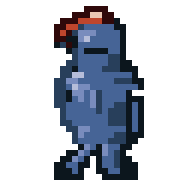
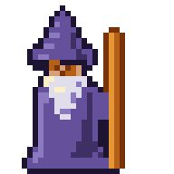
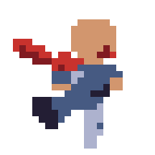
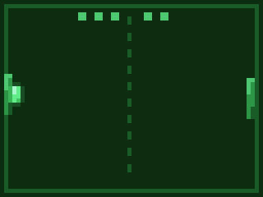
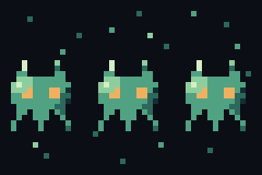

<p align="center">
  <picture>
    <source media="(prefers-color-scheme: dark)" srcset="docs/logo-wordmark-dark.png">
    
  </picture>
</p>

<p align="center"><strong>The pixel-art studio agents can see — headless, over MCP.</strong></p>

<p align="center">
  
</p>

<p align="center">
  
  
  
  
  
</p>
<p align="center">
  
  
  
  
  
  
  
</p>

<p align="center"><em>Every pixel in this README — including the logo — was drawn
by agents through the MCP tools. No hand-editing, no image imports.</em></p>

## What it is

Agents are good at *describing* art and bad at *seeing* it. atelier closes the
loop: every drawing op is a tool call, and `doc_look` hands back a PNG the
agent can actually look at, judge, and correct — the same look-and-fix loop a
human uses in an editor. One static Rust binary; no API keys, no network, fully
deterministic.

- **Real editor, headless** — layered, animated documents: 14 blend modes,
  frames + tags, selections, cross-document clipboard, palettes, onion-skinning.
- **Procedural leverage** — dithered gradients, fBm/perlin/voronoi noise,
  scatter, Bézier strokes, symmetry, shadow/glow/bevel, and one-call volume
  shading (`doc_fx op=form`: sphere/cylinder/auto — a flat silhouette gains real
  rounded-form lighting): compose effects instead of placing every pixel.
- **An eye for critique** — silhouette, stray-pixel, palette, contrast, frame-diff
  and loop-seam reports turn "does it look right?" into numbers an agent can act on.
- **Game-ready output** — spritesheets with rects/durations/tags/pivots,
  animated GIFs/APNGs, packed texture atlases, Tiled-ready tilesets and
  deterministic Wang-blob terrain sets. Any engine can slice it.
- **More than pixels** — a built-in pixel font (`doc_draw op=text`), one-call palette
  swaps for recolour variants, and the procedural/critique leverage above.
- **Built for agents** — MCP resources (browse documents + renders), packaged
  prompts (sprite / walk-cycle / tile workflows), a session recorder that turns a
  live session into a replayable recipe, a live `/gallery` web view, and an
  interactive `/playground` — run any tool from an auto-built form, or draw with
  the mouse where every gesture (pencil/line/rect/ellipse/fill) is a tool call.

By default the server advertises a **core profile** of ~28 tools — everything the
sprite / animation / tile / recreate-from-reference loops need. Set
`ATELIER_PROFILE=full` for the complete 67-tool surface (extra effects, rigging,
audits, library exports). The profile filters *discovery* only — every tool still
executes, so recipes and `atelier replay` always reach the long tail. The full
surface is documented in [docs/TOOLS.md](docs/TOOLS.md); release notes live in
[CHANGELOG.md](CHANGELOG.md).

## Quickstart

```sh
curl -fsSL https://marmikshah.github.io/atelier/install.sh | sh
```

The installer sets atelier up as stdio (your MCP client spawns it) or as a
shared background HTTP daemon, and prints the matching registration line —
e.g. `claude mcp add --scope user atelier -- atelier`. Re-run it to update,
or append `-s -- uninstall` to remove.

Prebuilt binaries cover macOS (Apple Silicon), Linux x86_64 and Windows
(grab the `.zip` from [releases](https://github.com/marmikshah/atelier/releases/latest));
anything else builds from source with `cargo install --path .`.

Restart your session (MCP tools load at session start), then ask your agent for
art — *"draw me a blinking cat sprite and export it as a GIF"*. The agent drives
the loop:

```
doc_create → paint → doc_look (look!) → fix → doc_export op=anim
```

Documents live under `~/.atelier` (override with `ATELIER_HOME`).

### Server modes

```sh
atelier                       # stdio MCP server (default — the client spawns it)
atelier --http 0.0.0.0:8765   # streamable HTTP at /mcp + live /gallery + /playground
make daemon                   # background HTTP server via launchd / systemd --user
```

Remote HTTP clients need their `Host` allow-listed (DNS-rebind guard):
`ATELIER_ALLOWED_HOSTS="workstation.local:8765" atelier --http 0.0.0.0:8765`,
then `claude mcp add --transport http atelier http://workstation.local:8765/mcp`.

## Recipes: deterministic, replayable art

Every document is an ordered sequence of tool calls, so a piece of art can be a
**recipe** — a JSON file that replays identically every time and verifies itself
with the analysis tools along the way:

```sh
atelier replay docs/examples/invader-march.json --home /tmp/atelier-demo
```

Four annotated examples live in [docs/examples/](docs/examples/): a 2-frame
invader march, a seamless animated water tile, an eased pong loop, and a
14-frame stickman kamehameha showing layered character animation (pose-per-frame
body, camera-shake background, glow-bloomed beam fx). They double as
integration tests and as documentation.

## More

- [docs/TOOLS.md](docs/TOOLS.md) — the complete MCP tool reference.
- [docs/ARCHITECTURE.md](docs/ARCHITECTURE.md) — the crate layout and how it fits together.
- [CHANGELOG.md](CHANGELOG.md) — release notes.
- Everything in [docs/](docs/) is agent-made; the gallery pieces were each
  drawn, self-audited and reviewed entirely over MCP.

## License

Dual-licensed under [MIT](LICENSE-MIT) or [Apache-2.0](LICENSE-APACHE), at
your option.
