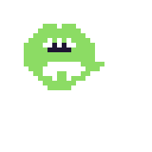
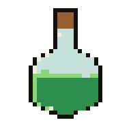
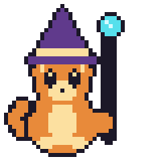
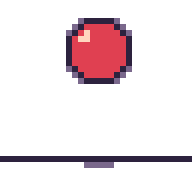

<p align="center">
  <picture>
    <source media="(prefers-color-scheme: dark)" srcset="docs/logo-wordmark-dark.png">
    
  </picture>
</p>

<p align="center"><strong>The pixel-art studio agents can see — headless, over MCP.</strong></p>

<p align="center">
  <a href="https://github.com/marmikshah/atelier/actions/workflows/ci.yml"></a>
  <a href="https://github.com/marmikshah/atelier/releases/latest"></a>
  <a href="LICENSE"></a>
</p>

<p align="center">
  
</p>

<p align="center">
  
  
  
  
</p>
<p align="center"><em>Alien by Haiku 4.5 · potion by Sonnet 5 · wizard cat by Opus 4.8 ·
ball by Fable 5 — same briefs, four models, zero hand-editing.
Full benchmark with compare views: <a href="https://marmikshah.github.io/atelier/">marmikshah.github.io/atelier</a>.</em></p>

## What it is

Agents are good at *describing* art and bad at *seeing* it. atelier closes the
loop: every drawing op is a tool call, and `doc_look` hands back a PNG the
agent can actually look at, judge, and correct — the same look-and-fix loop a
human uses in an editor. One static Rust binary; no API keys, no network, fully
deterministic.

- **A real editor, headless** — layers, frames, tags, selections, locked
  palettes; generators for figures, walk/pose cycles, autotile terrain,
  9-slice panels and particle FX.
- **An eye, not just a hand** — critique, palette, silhouette, animation and
  colour-blindness audits turn "does it look right?" into numbers an agent
  acts on; `doc_set_audit` judges a whole asset set as one game.
- **Game-ready out of the box** — spritesheets with pivots/hitboxes/tags,
  GIF/APNG, texture atlases, Tiled tilesets, engine-standard JSON.

## Quickstart

```sh
curl -fsSL https://marmikshah.github.io/atelier/install.sh | sh
```

The installer registers atelier with your MCP client (stdio or a background
HTTP daemon). Restart your session, then ask your agent for art — *"draw me a
blinking cat sprite and export it as a GIF"*. Under the hood that becomes:

```
doc_create → paint → doc_look (look!) → fix → doc_export op=anim
```

| | |
|---|---|
| **Prebuilt binaries** | macOS (Apple Silicon), Linux x86_64, Windows — [latest release](https://github.com/marmikshah/atelier/releases/latest) |
| **From source** | `cargo install --path .` |
| **Docker** | `ghcr.io/marmikshah/atelier` (see below) |
| **Documents live in** | `~/.atelier` (override with `ATELIER_HOME`) |
| **Tool profile** | 20-tool core by default; `ATELIER_PROFILE=full` for all 63 |

## Docker

A public multi-arch image (amd64 + arm64) runs the HTTP MCP server — no local
toolchain needed:

```sh
docker run -d --name atelier -p 8765:8765 -v atelier-data:/data \
  ghcr.io/marmikshah/atelier:latest
```

Then point any MCP client at the HTTP endpoint:

```sh
claude mcp add --scope user --transport http atelier http://127.0.0.1:8765/mcp
# Cursor: ~/.cursor/mcp.json -> "atelier": { "url": "http://127.0.0.1:8765/mcp" }
```

Documents persist in the `atelier-data` volume. `docker compose up -d` works too
(see [docker-compose.yml](docker-compose.yml)). Set `-e ATELIER_PROFILE=core` for
the lean tool set; to reach the server from another host set
`-e ATELIER_ALLOWED_HOSTS=<host[:port]>`.

## Recipes

Every document is an ordered sequence of tool calls, so art is a **recipe** —
a JSON file that replays byte-identically and doubles as an integration test:

```sh
atelier replay docs/examples/invader-march.json --home /tmp/atelier-demo
```

The recipes under [docs/examples](docs/examples) are both the brand art and
the test suite — run `make branding` to watch all of them draw.

## How it's built

A strict four-crate tower — functional core, imperative shell. `atelier-core`
(document model + raster math) knows nothing about MCP; `atelier-studio` is
the one-method-per-tool facade; `atelier-mcp` is the thin tool router over
stdio and HTTP; the `atelier` binary adds the installer and the replay runner.

Start with the illustrated tour — the smallest units (cel + op), the
composition ladder, and the life of a tool call:
**[marmikshah.github.io/atelier/architecture.html](https://marmikshah.github.io/atelier/architecture.html)**

## Documentation

| Where | What |
|---|---|
| [Benchmark gallery](https://marmikshah.github.io/atelier/) | Different models, identical briefs, the same studio in different hands |
| [Architecture tour](https://marmikshah.github.io/atelier/architecture.html) | The crate tower, the life of a tool call, onboarding paths |
| [Tool reference](https://marmikshah.github.io/atelier/tools.html) | All 63 tools, generated from the live registry |
| [docs/ARCHITECTURE.md](docs/ARCHITECTURE.md) | Crate and module layout, in the repo |
| [CHANGELOG.md](CHANGELOG.md) | Release notes |

## A personal note

atelier started as an experiment with one question behind it: can AI agents,
using only tool calls, build art that is genuinely good enough to ship in a
game?

Every line of code here was written by AI — Claude Opus 4.8 and Fable 5 did
the heavy lifting, with Kimi 2.6 and Minimax 2.7 pitching in. I didn't write a
single line myself. My part was direction: holding the project to the same
practices and standards I use in the projects where I *do* still write the
code.

This is an ongoing experiment. As time allows, I'll keep running the
benchmark against other model families — GPT, Gemini, and whatever else looks
promising — and trying different designs to see how each of them holds a
brush.

If atelier helps you in any way — as a tool, a reference, or just a kick-start
on your own game-design journey — that makes me genuinely happy. The tokens
are already spent; the least they can do is be useful to you too.

## Notice — versions below 2.0.0

> [!WARNING]
> I intend to follow [SemVer](https://semver.org), but be realistic about what
> this project is: AI-generated code. Diffs are large, and every release below
> 2.0.0 will likely contain breaking changes despite my best intentions.
>
> Once I'm confident the tool has proven itself, I will cut a **2.0.0**
> release — that is the point where I start reviewing the code in detail and
> contributing to it directly. 2.0.0 will be tagged by me, by hand — it is the
> one release an AI agent is not allowed to cut. Until then, assume that
> anything below 2.0.0 has **not** been fully reviewed by me and may contain
> bugs or security issues I haven't caught.
>
> **Use at your own risk.**

## License

[MIT](LICENSE).
