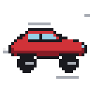
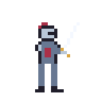

<p align="center">
  <picture>
    <source media="(prefers-color-scheme: dark)" srcset="site/assets/logo-wordmark-dark.png">
    
  </picture>
</p>

<p align="center"><strong>The pixel-art studio agents can see.</strong><br>
Layered, animated, game-ready art — from your CLI, or over MCP.</p>

<p align="center">
  <a href="https://github.com/marmikshah/atelier/actions/workflows/ci.yml"></a>
  <a href="https://github.com/marmikshah/atelier/releases/latest"></a>
  <a href="LICENSE"></a>
  
</p>

<p align="center">
  
</p>

<p align="center">
  
  
  
  
  
  
</p>

<p align="center"><em>Not one pixel was hand-placed. Every frame is a tool call.<br>
<a href="https://marmikshah.github.io/atelier/">See every model draw the same ten tasks →</a></em></p>

---

## Install

```sh
curl -fsSL https://marmikshah.github.io/atelier/install.sh | sh
```

Installs the binary. That's the whole setup — drive it from any shell:

```sh
atelier call doc_create '{"name":"cat","width":32,"height":32}'
atelier call doc_draw '{"doc_id":"cat","layer":0,"frame":0,"op":"fill_cel","color":[224,160,80]}'
atelier call doc_look '{"doc_id":"cat","out_path":"/tmp/cat.png"}'
```

Every tool is one `atelier call`: stdout gets the JSON report, the exit code
the verdict (0 ok, 1 tool error, 2 bad call). `atelier tools` lists the
surface; `atelier tools --schema <name>` dumps one tool's input schema. Any
agent with a shell — Claude Code, Kimi Code or Cursor — drives it exactly this
way: no registration, no daemon, no restart. Just ask:

> *"draw me a blinking cat sprite and export it as a GIF"*

<p align="center">
  <code>doc_create</code> → <code>paint</code> → <b><code>doc_look</code></b> → <i>fix</i> → <code>doc_export</code>
</p>

### Other ways

- **Binaries** — macOS (ARM), Linux x86_64, Windows: [latest release](https://github.com/marmikshah/atelier/releases/latest)
- **Source** — `cargo install --path crates/atelier`, or `site/install.sh --source`
  to build this checkout and install it

## Optional: run as an MCP server

For clients that only speak MCP, the same binary is an MCP server — one
command sets up a shared background daemon (launchd / systemd):

```sh
atelier install
```

Then register it, the same shape for every client:

```sh
claude mcp add --scope user --transport http atelier http://127.0.0.1:8765/mcp   # Claude Code
# Kimi Code: ~/.kimi-code/mcp.json  ->  "atelier": { "url": "http://127.0.0.1:8765/mcp" }
# Cursor:    ~/.cursor/mcp.json     ->  "atelier": { "url": "http://127.0.0.1:8765/mcp" }
```

Or skip the daemon and let each client spawn the server itself over stdio —
zero setup, but each client gets its own store:

```sh
claude mcp add --scope user atelier -- atelier   # Claude Code
# Kimi Code: ~/.kimi-code/mcp.json  ->  "atelier": { "command": "atelier" }
# Cursor:    ~/.cursor/mcp.json     ->  "atelier": { "command": "atelier" }
```

### Docker

Prefer a container? One small image — a static musl binary on Alpine (~15 MB),
multi-arch (amd64 + arm64) — serving the same HTTP MCP endpoint:

```sh
docker run -d -p 127.0.0.1:8765:8765 -v atelier-data:/data ghcr.io/marmikshah/atelier
```

Documents persist in the `atelier-data` volume, so they survive restarts.
There's a [`docker-compose.yml`](docker-compose.yml) if you'd rather keep it
declarative.

### MCP notes

- **Your client shows 0 tools** — restart it after registering; MCP clients read
  their server list at session start.
- **stdio or daemon?** The daemon is one shared server and store, and it
  survives reboots; stdio means each client spawns its own `atelier`, and each
  gets its own store. (The CLI needs neither — it talks to the store directly.)
- **Port 8765 already in use** — `atelier status` shows whether it's our daemon
  (`atelier uninstall` stops it) or something else holding the port.
- **Where are the logs?** The daemon writes `~/.atelier/logs/atelier.{out,err}.log`;
  verbosity via `ATELIER_LOG` (`RUST_LOG` syntax). In stdio mode the same log
  goes to the spawning client's stderr.
- **Uninstall everything** — `install.sh uninstall` (or `atelier uninstall` for
  just the daemon). Your documents in `~/.atelier` are kept; delete that
  directory too if you want them gone.

## Why it's different

Agents are good at *describing* art and bad at *seeing* it. So most AI pixel art
is drawn blind — the model guesses, never looks, and ships the guess.

**atelier gives the agent an eye.** `doc_look` hands back the actual frame as an
image, plus measured stats. The agent looks at its own work, judges it, and fixes
it — the same loop a human uses in an editor. Nothing sends pixels back unless the
agent asks to see them: every drawing tool answers in text, so looking is a
deliberate act, and the context stays small enough to look often.

|  |  |
|---|---|
| 🎨 **A real editor, headless** | Layers, frames, tags, selections, locked palettes, checkpoints. Draw with primitives or paint a whole region declaratively from a character grid. |
| 👁 **An eye, not just a hand** | Critique, palette, silhouette and animation audits turn *"does it look right?"* into numbers an agent can act on. |
| 🎮 **Game-ready out of the box** | Tagged spritesheets, GIF/APNG, texture atlases, Tiled tilesets, engine-standard JSON. |
| 🔒 **Yours, offline** | One static Rust binary. No API keys, no network, no telemetry. Fully deterministic. |

## The CLI

```sh
atelier call <tool> '<json>'   # one tool call, in-process — the front door
atelier call <tool> --file ops.json   # args from a file (or --stdin)
atelier tools [--schema <name]]       # the tool surface / one input schema
atelier replay <recipe|id>     # rebuild a document from its journal
atelier library                # what's in your document store
atelier doctor                 # check the whole setup, print what to fix
atelier skills install         # write the skills for your agent (--for claude|kimi|cursor|all)
atelier agent --task "..."     # the one online mode (feature-gated)
```

And the MCP add-on:

```sh
atelier                    # stdio MCP server (your client spawns it)
atelier --http             # HTTP server at 127.0.0.1:8765/mcp
atelier install            # background daemon (launchd / systemd)
atelier status             # daemon state and log locations
atelier uninstall          # stop and remove the daemon
```

Every call — CLI, replay, stdio or HTTP — travels one dispatch path, so it logs
the same line to stderr: tool name, op, target document, caller, duration, and
the error text when a call fails. The daemon collects this in
`~/.atelier/logs/atelier.err.log`; tune verbosity with `ATELIER_LOG`
(`RUST_LOG` syntax, default `info`). When several agents share the daemon,
every call logs a `caller=` identity: by default the TCP peer address, which
separates concurrent sessions — even two windows of the same client — with no
configuration; set an `X-Atelier-Caller` header in a client's MCP config to
use a stable name instead. (The CLI and replay log as `cli` / `replay`.)
(Same-name collisions are already impossible: `doc_create` mints a unique id —
`hero`, `hero-2`, … — and every caller must use the id it got back.)

**28 tools**, all of them advertised — no profiles to pick, nothing hidden behind
a flag. Every one is a tool an agent or a shipped recipe actually reaches for.
Browse them in the [tool reference](https://marmikshah.github.io/atelier/tools.html),
or see how a call flows through the crates in the
[architecture tour](https://marmikshah.github.io/atelier/architecture.html).

## Agent mode — the one online command

Everything above is offline, keyless and deterministic. `atelier agent` is the
exception: it drives an OpenAI-style API to draw a task by itself, no external
client needed.

```sh
cargo install --path crates/atelier --features agent   # opt in — links the HTTP stack
export OPENAI_API_KEY=sk-…
atelier agent --task "a bouncing slime, 8 frames" --out slime.gif
```

The atelier-sprite, -scene and -review skills are **baked into the binary**, so
that bare command just works — no files, no Claude, no repo checkout.
`--skill scene|review` picks another, `--skill-file <path>` injects your own.

It's off by default — a normal build and the daemon link no network stack at all
— and it reuses the same dispatch path everything else does, so the model draws
through the exact validated path (schemas, journaling, replay). Any
OpenAI-compatible endpoint works via `--base-url`.

## Skills

Tools are the hand; these are the craft. Three [skills](crates/atelier/skills) the
installer offers to add to your agent — Claude Code, Kimi Code or Cursor:

| | |
|---|---|
| **atelier-sprite** | one subject — character, creature, vehicle, prop |
| **atelier-scene** | a place — background, environment, composed picture |
| **atelier-review** | judge finished art and say what's wrong, with a fix |

Both drawing skills insist on the same two things: **build it in layers**, and
**fix the region that's wrong instead of repainting the frame**. They prescribe
no style and no palette — that's the request's business. And they're
transport-free: every tool they name is one `atelier call`, or the same-named
MCP tool when you're connected over MCP.

Install or refresh them any time — `atelier skills install` (Claude Code by
default, `--for kimi|cursor|all` for the others).

atelier works fine without them; they just make the art better.

## Art is a recipe

Every document is an ordered sequence of tool calls, so a piece of art *is* a
replayable program — and atelier keeps that sequence for you. Every document
journals itself as it's drawn, so anything you make can rebuild itself:

```sh
atelier library                 # every document, with its step count
atelier replay my-sprite        # rebuild it from its own journal
```

Nothing to turn on. The journal is JSON Lines beside the art
(`~/.atelier/documents/<id>/recipe.jsonl`), one tool call per line — only the
calls that *made* something, never the looks and audits. Replay it into a
sandbox with `--home /tmp/demo` and you get the same pixels, anywhere:

```sh
atelier replay docs/examples/invader-march.json --home /tmp/demo
```

The recipes in [docs/examples](docs/examples) are both the brand art and the
integration tests. `--record session.jsonl` captures a whole sitting across
several documents. MCP clients can also read any live document directly:
`atelier://doc/<id>` (structure JSON) and `atelier://doc/<id>/render` (frame 0
as PNG).

## A personal note

atelier began as one question: can agents, using only tool calls, make art good
enough to ship in a game?

**100% of this code was written by AI.** Not assisted — written. Claude Opus 4.8
and Fable 5 did the heavy lifting, with Kimi 2.6 and Minimax 2.7 pitching in. I
have not written a line. My part was direction, held to the standards I use where
I *do* still write the code. If it helps you build something, the tokens were
worth spending — and a ⭐ helps the next person find it.

> [!WARNING]
> **Below 2.0.0, no human has reviewed this code.** Assume bugs and security
> issues I haven't caught, and breaking changes in any release. Use at your own
> risk. **2.0.0 is where I start reviewing in detail** — tagged by hand, the one
> release an agent may not cut.

## Contributing

Not accepting external code contributions until **v2.0.0** — pull requests are
closed automatically until then. Bug reports and ideas are very welcome as
[issues](https://github.com/marmikshah/atelier/issues).

[Contributing](.github/CONTRIBUTING.md) · [Code of Conduct](.github/CODE_OF_CONDUCT.md) · [Security](.github/SECURITY.md) · [Changelog](CHANGELOG.md)

## License

[MIT](LICENSE) © Marmik Shah
