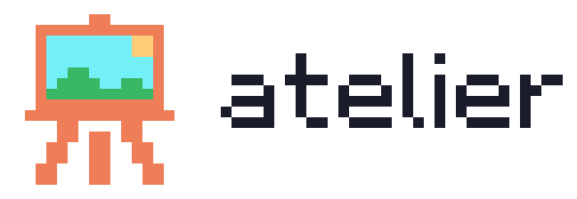

<p align="center">
  <picture>
    <source media="(prefers-color-scheme: dark)" srcset="assets/logo-wordmark-dark.png">
    
  </picture>
</p>

Atelier is an offline, headless pixel-art editor for shell automation and MCP
clients. Its 26 tools edit layered animations, inspect rendered pixels, and
export PNGs, spritesheets, GIFs, APNGs, and pixel fonts. Documents and replay
journals stay local; the editor needs no account or outbound service.

**[Explore the model showcase →](https://marmikshah.github.io/atelier/)**
Claude, Codex, and Kimi draw the same ten briefs. Compare all models in an
artwork table with pinned headers and filters for provider, model, and brief.
Switch to sortable run data, export filtered results as CSV, or open an
animation to inspect its prompt, statistics, and original replay. Views can
be shared with their filters, zoom, and background.

## Build and draw

Build from source; there are no published releases or container images:

```sh
git clone https://github.com/marmikshah/atelier.git
cd atelier
cargo install --locked --path crates/atelier
atelier call doc_new '{"name":"cat","width":32,"height":32}'
```

Use the returned `doc_id` in later calls, with explicit layer and frame targets:

```sh
atelier call doc_draw '{"doc_id":"<returned-id>","layer":0,"frame":0,"op":"fill_cel","color":[224,160,80]}'
atelier call doc_look '{"doc_id":"<returned-id>","out_path":"/tmp/cat.png"}'
```

Linux supports the editor and the `systemd --user` daemon. macOS builds and
passes tests but has no daemon. Use Docker on Windows. Rust 1.88 is the minimum
supported compiler; `rust-toolchain.toml` selects the development toolchain.

## Commands and documents

The binary owns its reference: `atelier --help`, `atelier tools --markdown`,
and `atelier tools --schema <tool>` describe the commands and tool arguments.

```sh
atelier init                         # create a directory-local .atelier store
atelier library                      # list documents
atelier library verify               # check stored documents without changes
atelier library pack <id> --out art.atelierpack
atelier library unpack art.atelierpack
atelier replay <journal|id> --home /tmp/demo
atelier skills install --for codex   # also claude, kimi, cursor, or all
atelier skills show sprite           # also scene or review
```

Store selection is `--home DIR`, then `ATELIER_HOME`, then a local `./.atelier`,
then `~/.atelier`. Each document records deterministic editing calls in
`documents/<id>/recipe.jsonl`; replay stages the entire document before
publishing it. Archives preserve UUIDs and refuse collisions unless replacement
is explicitly requested. Checkpoints provide bounded local recovery.

CLI, replay, stdio, and HTTP use one dispatch path. There is no active document
or inferred target. Mutations may include `expected_revision` to reject a stale
write with `revision_conflict`; omitting it keeps last-write-wins behavior.

Spritesheets default to RGBA PNGs. Set `color_mode` to `rgb` when a consumer
requires a PNG without an alpha channel:

```sh
atelier call doc_export '{"doc_id":"<returned-id>","op":"sheet","out_path":"cat.png","scale":1,"color_mode":"rgb"}'
```

RGB export requires every rendered pixel in every frame to be fully opaque;
transparency causes an error before the output files are written. It preserves
exact RGB values and nearest-neighbour scaling. Both the native sidecar and
`meta:"standard"` sidecar record the PNG's channel format.

Pixel glyph atlases can also be exported as static TrueType fonts. Draw glyphs
on a transparent canvas, then store their mappings and metrics with `doc_font`.
For a 16×8 atlas with an 8×8 missing glyph followed by an 8×8 letter A:

```sh
atelier call doc_font '{"doc_id":"<returned-id>","op":"set","font":{"family":"My Pixel Font","baseline":7,"ascent":7,"descent":1,"missing_glyph":0,"space_glyph":1,"glyphs":[{"name":"missing","codepoints":[],"rect":[0,0,8,8],"advance":8},{"name":"space","codepoints":[32],"rect":null,"advance":4},{"name":"A","codepoints":[65],"rect":[8,0,8,8],"advance":8}]}}'
atelier call doc_export '{"doc_id":"<returned-id>","op":"font","out_path":"my-pixel-font.ttf"}'
```

Glyph rectangles use `[x,y,width,height]` in the atlas; baseline is measured down
from each rectangle's top edge. Advances, ascent, descent, line gap, and optional
`bearing_x` are in source pixels. `frame` defaults to 0 and follows timeline
reordering; deleting that frame requires clearing or replacing the font metadata.
Multiple Unicode scalar values in `codepoints` share a glyph. The explicit space
glyph has no rectangle; the missing glyph must contain solid pixels and becomes
TrueType glyph zero. `doc_font op=get` reads metadata and `op=clear` removes it.
Set/clear are guarded by `expected_revision` and recorded in replay journals.

Export uses the visible, composited atlas frame, ignores pixel RGB colours, and
requires alpha to be 0 or 255 inside glyph rectangles. Integer outlines preserve
the pixel grid without curves or hinting; `gasp` requests no grid fitting or
smoothing, though text renderers control their own antialiasing. Font units default
to `units_per_em:1024` and `units_per_pixel:64`, so a 16-pixel em uses a 16px text
size. Image export options such as `scale` do not apply to font export. Mappings,
rectangles, metrics, and TrueType coordinate limits are validated before writing.

## MCP and Docker

Configure a stdio MCP client to launch `atelier`, or install the Linux daemon:

```sh
atelier install --port 8765
atelier status
# Endpoint: http://127.0.0.1:8765/mcp
```

`atelier --http [ADDR]` runs a foreground HTTP server. Non-loopback listeners
require `ATELIER_HTTP_TOKEN`; when set, every request needs the matching bearer
token. Use a TLS reverse proxy for remote access. HTTP file access requires
`ATELIER_IMPORT_ROOT` or `ATELIER_EXPORT_ROOT` and relative paths under those
directories. CLI and stdio retain normal local filesystem access.

Set `ATELIER_HTTP_TOKEN` in your environment, then run the container:

```sh
docker compose up -d --build
```

It exposes `127.0.0.1:8765/mcp` and persists documents in a named volume.
`ATELIER_PLATFORM=linux/arm64` selects ARM64; CI checks `linux/amd64`.
Daemon logs: `journalctl --user -u atelier -f`. Remove it with `atelier uninstall`.

## Develop and build the showcase

```sh
tools/check.sh                       # format, lint, rustdoc, tests, site build
cargo fmt --all                      # apply formatting
cargo build --release --locked -p atelier
cargo build --locked -p atelier
tools/showcase-check.sh               # reproduce every committed GIF
python3 tools/build-site.py           # static site → target/site, no dependencies
python3 -m http.server 8000 --directory target/site
```

The website uses plain HTML, CSS, and JavaScript. Its build reads
`showcase/runs.json`, frozen briefs, GIFs, and replay journals; the generated
site stays in ignored `target/site`. GitHub Pages publishes it when changes
reach `master`. CI is self-contained and uses only public actions.

To collect another showcase run with an authenticated Codex CLI:

```sh
python3 tools/run-showcase.py --model gpt-6.1-sol --effort max
```

The runner uses isolated stores and the shipped sprite skill, verifies replay
bytes, and writes transcripts, art, and usage to `target/showcase/`. Its
`--help` describes task selection and resuming interrupted sessions. Preserve
the counting-method caveats in `showcase/runs.json` when adding results.

## About the project

Atelier asks whether agents working through tools can make art useful in games.
All code was written by AI and has had no line-by-line human review. Assume
bugs and breaking changes; review the code and isolate important data before
using it in production.

Outside pull requests are closed; bug reports and questions are welcome.
Report vulnerabilities privately through [SECURITY.md](.github/SECURITY.md).
See [CONTRIBUTING.md](.github/CONTRIBUTING.md) for participation details.

[MIT](LICENSE) © Marmik Shah
