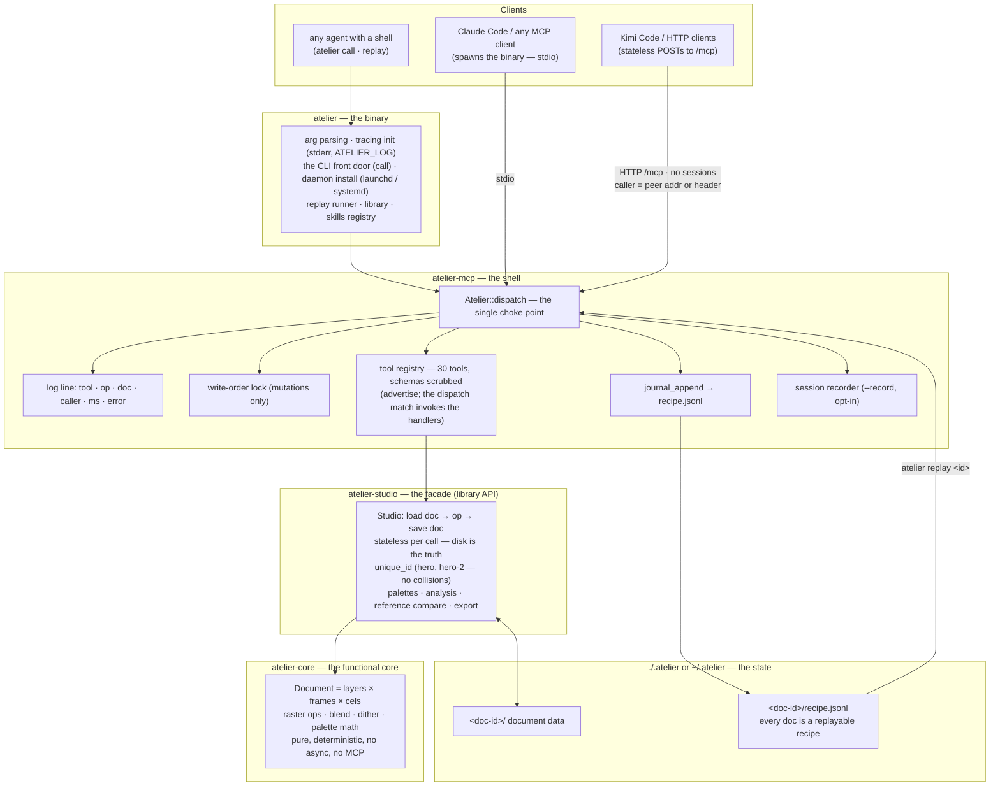

# Architecture

atelier's shipped system is a strict four-crate dependency tower: a pure
document/raster core, the studio operations that act on it, the dispatch layer
and MCP server that expose those operations as tools, and the binary that wires
up the CLI and transports. Each layer depends only on the ones below it — there
are no cycles.

```
            ┌─────────────────────────────────────────────┐
  binary →  │  atelier            main · call · service ·  │  arg parsing, the CLI
            │                     replay · library ·       │  front door, daemon,
            │                     skills                   │  replay, skills
            │                     (the `atelier` binary)   │
            └───────────────────────┬─────────────────────┘
                                    │ depends on
            ┌───────────────────────▼─────────────────────┐
  shell  →  │  atelier-mcp        dispatch · server ·      │  one dispatch path;
            │                     recipe                   │  rmcp stdio + HTTP
            └───────────────────────┬─────────────────────┘
                                    │
            ┌───────────────────────▼─────────────────────┐
  core   →  │  atelier-studio     studio · craft ·         │  the Studio facade:
            │                     analysis · reference     │  one fn per operation
            └───────────────────────┬─────────────────────┘
                                    │
            ┌───────────────────────▼─────────────────────┐
  model  →  │  atelier-core       document · raster        │  layered/animated doc
            │                     (no async, no MCP)       │  model + pixel ops
            └─────────────────────────────────────────────┘
```

This is a *functional core, imperative shell*: `atelier-core` and
`atelier-studio` are deterministic, synchronous, and dependency-light; all of the
async, networking, and protocol surface lives in `atelier-mcp` and the binary.

## The full picture

The same tower with the runtime paths drawn in — how a tool call flows, where
every cross-cutting concern hooks, and why the server can be stateless
(GitHub renders this diagram; raw readers get the ASCII art above).



Properties the shape guarantees:

- **Strict downward tower** — each arrow points one way; the core imports
  nothing above it. Transport bugs get fixed in the shell without touching art
  logic.
- **One choke point** — logging, journaling, write ordering, and recording all
  hang off `Atelier::dispatch`, the one path CLI, MCP stdio/HTTP, and replay
  every caller shares; no caller can dodge them.
- **Disk is the state** — no server-side session, so the HTTP transport is
  stateless: a daemon restart is invisible mid-conversation.
- **Recipe = provenance** — art is an ordered list of tool calls; any document
  rebuilds from its own journal.

## The crates

### `atelier-core` — the document model (no async/MCP)

The functional core. Has no knowledge of MCP, tokio, or the network.

- **`document/`** — `Document`: an ordered stack of layers over a timeline of
  frames. A *cel* is the RGBA image for one (layer, frame). `mod.rs` holds the
  types, persistence and layer/frame structure; siblings split the operations by
  responsibility — `draw` (primitives), `region` (clipboard/transform), `fx`
  (effects), `timeline` (frames, tags, timing), `palette`, `render` (flatten +
  read-only analysis), `export` (sheet/GIF/APNG writers) and `batch` (the op
  registry, `draw_ops()`/`fx_ops()` partition and validator). Persists as a
  directory: `doc.json` (structure + cel file refs) plus one PNG per cel under
  `cels/L<layer>_F<frame>.png`.
- **`raster/`** — the pixel-level primitives the layers above compose. `mod.rs`:
  point/brush/line plotting, the anti-aliased `stroke_ribbon`, the 14 blend
  modes and `composite`, the pixel font glyphs; `colour`: sRGB ⇄ OKLab/OKLCh/HSL
  conversions, ΔE, ramps and median-cut quantisation; `noise`: fBm/Perlin/Voronoi
  noise, ordered and blue-noise dither thresholds, gradient sampling; `transform`:
  area-average downscale, corner-seeded background removal and chamfer distance
  fields.

Dependencies: `image`, `serde`, `serde_json`, `png` (APNG encode).

### `atelier-studio` — the operations

The `Studio` facade: a flat document store rooted at `ATELIER_HOME` (default
`~/.atelier`), exposing **one public method per editor operation** — each takes
plain arguments and returns `Result<serde_json::Value, String>`. This is the
entire library API; the MCP layer is a thin wrapper over it.

- **`lib.rs`** (the `Studio` struct) — the facade: structure/timeline ops
  (layers/frames/tags), the per-cel drawing entrypoints (palette,
  `doc_paint_grid`, batch/draw/fx dispatch) and shared helpers. The modules
  below are one `impl Studio` block each:
- **`store.rs`** — store/document lifecycle (create/open/list/delete), the
  journal (`recipe.jsonl`), and `Studio::default_home()` — the single
  store-resolution policy the binary delegates to: `ATELIER_HOME` → a
  project-local `./.atelier` when one exists (`atelier init` stamps it) → the
  global `~/.atelier`. `Studio::new()` resolves it;
  `Studio::with_docs_dir(path)` roots a studio at an explicit
  directory (for embedding or tests, without touching process-global env).
- **`ops_export.rs`** — every export entry point + dispatch (sheet/GIF/APNG/
  atlas/tileset).
- **`ops_region.rs`** — selections (`doc_select`) and clipboard/region ops.
- **`craft.rs`** — constructive ops: checkpoints, layer/colour ops, import.
- **`view.rs`** — the see-tools: `doc_look` and the
  contact sheet.
- **`analysis.rs`** — the "eye": critique, silhouette, palette, contrast,
  frame-diff and loop-seam reports that turn "does it look right?" into numbers.
- **`set.rs`** — the game layer: resolve a document family (ids/prefix) and
  broadcast a palette across it (`doc_palette op=sync`).
- **`reference.rs`** — reference-image workflow: set/analyse a reference and score
  silhouette IoU + per-cell ΔE against it (`doc_ref op=compare`).

Dependencies: `atelier-core`, `image`, `serde_json`, `dirs`.

### `atelier-mcp` — dispatch + the MCP server

The imperative shell. Wraps `Studio` in an `Arc<Mutex<…>>` and exposes it.

- **`server/`** — `mod.rs` holds the server state and **`Atelier::dispatch`**,
  the single path every caller (MCP stdio/HTTP, `atelier call`, replay)
  funnels through: classify journaled/recorded → write-order lock → deserialize
  params → run the handler → log → journal/record. The four domain routers
  (`tools_doc`, `tools_draw`, `tools_read`, `tools_export`) hold the 30
  `#[tool]` handlers and their schemas — the registry the surface is advertised
  from — with the param structs (`params.rs`), the two transports
  (`transport.rs` — stdio `run` + streamable HTTP `run_http`, re-exported as
  `server::{run, run_http}`), session `Recorder` (`recorder.rs`) and MCP
  resources (`resources.rs`) as siblings: **30 tools** (mutations grouped into
  op-dispatch tools like `doc_draw` / `doc_fx` / `doc_export` / `doc_batch`),
  one or one-family per studio operation. All 30 are advertised unconditionally
  — there is no profile filter. The `Recorder` turns a live session into a
  replayable recipe.
- **`recipe.rs`** — the `Recipe`/`Step` format: the on-disk contract shared by the
  `Recorder` (writer) and the `atelier replay` runner (reader). Lives here, in the
  library crate, so anything embedding atelier can read/write recipes without the
  binary.

Dependencies: `atelier-core`, `atelier-studio`, `rmcp`, `axum`, `tokio`, `schemars`, `serde`.

### `atelier` — the binary

Thin wiring; produces the `atelier` executable.

- **`main.rs`** — arg/env parsing and subcommand dispatch (the CLI verbs, the
  daemon, or the MCP transports: stdio vs `--http`, `--record`).
- **`call.rs`** — `atelier call`: one tool call, in-process through
  `Atelier::dispatch` — the CLI front door the whole surface hangs off.
- **`service.rs`** — installs/uninstalls the background daemon (launchd on macOS,
  `systemd --user` on Linux).
- **`replay.rs`** — the `atelier replay` runner: an in-process dispatch loop, one
  `dispatch` per recipe step, strictly sequenced, with recorded→minted id
  remapping.

Dependencies: `atelier-mcp`, `atelier-studio`, `rmcp`, `tokio`, `serde_json`,
`toml_edit`, `tracing-subscriber`.

## Request flow

A single drawing tool call travels straight down the tower and back, whatever
front door it came in:

```
external agent → atelier call | MCP tools/call | replay
               → Atelier::dispatch (log · write-order lock · journal)
               → the tool's handler → Studio::doc_<op>(args)   (atelier-studio)
               → Document / raster mutation                    (atelier-core)
               → persist to ~/.atelier/documents/<id>/
               → render PNG → returned to the agent to look at
```

Because every mutation is one tool call and documents are an ordered sequence of
them, a piece of art is a **recipe** (`atelier-mcp::recipe`) that replays
deterministically — which is also how the `docs/examples/` integration tests work.

## Conventions

- **Tests live next to the code** they cover, as inline `#[cfg(test)]` modules
  (the bulk in `atelier-core` and `atelier-studio`). `cargo test`,
  `cargo clippy --all-targets -- -D warnings`, and `cargo fmt --all` run at the
  workspace root.
- **Dependency versions are centralised** in the root `[workspace.dependencies]`;
  crates inherit with `<dep>.workspace = true`. Package metadata (version, license,
  repository) is shared via `[workspace.package]`.
- **`Cargo.lock` is committed** because this workspace ships the `atelier`
  executable. CI, source installation, Docker, and release builds use
  `--locked`; dependency updates are deliberate reviewable diffs.
- **The release binary is unchanged at `target/release/atelier`** — the virtual
  workspace doesn't move it, so `install.sh`, the `Makefile`, and the release
  workflow need no path changes.
