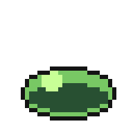
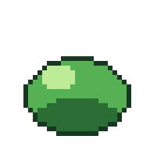
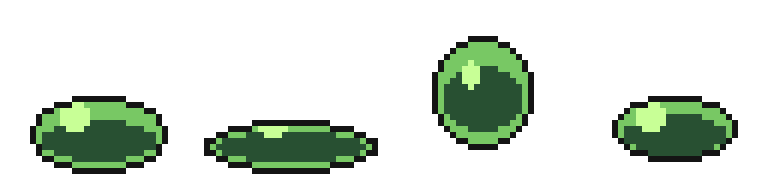
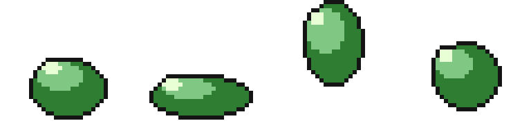
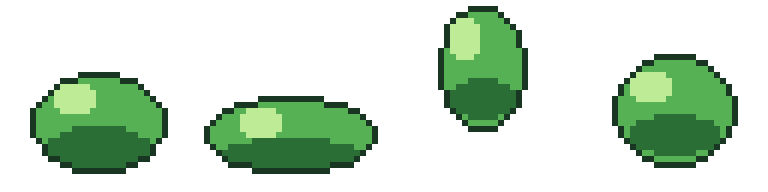
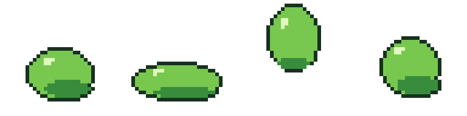

# Showcase — four models, one brief

Every piece below was drawn through atelier's MCP tools by a different model
given the **same instruction set, verbatim** — no retries, no cherry-picking,
no human touch-ups. Different hands, same studio.

## The bounce

*"Animate a 4-frame bouncing slime with squash and stretch: rest → squash →
airborne stretch → descend. Lock 4 colours. Look after every burst; fix what
reads wrong."*

| Haiku 4.5 | Sonnet 5 | Opus 4.8 | Fable 5 |
|:---:|:---:|:---:|:---:|
|  |  |  |  |

The frames, side by side:

## The potion

*"Draw a potion bottle: rounded flask, cork, liquid two-thirds with a meniscus
and a glass highlight, light top-left, 1px outline. Lock 6 colours."*

| Haiku 4.5 | Sonnet 5 | Opus 4.8 | Fable 5 |
|:---:|:---:|:---:|:---:|
|  |  |  |  |

## Why it works on every model

The studio carries the discipline, so any model ships clean art: every run —
smallest to largest — landed **zero off-palette pixels, zero stray pixels, a
closed silhouette, and a looping tag**, because the loop makes it hard not to:
lock a palette → draw → *look* → audit → fix. Along the way one run recovered
a wrecked shape with `doc_checkpoint restore`, and another verified its jump
arc with onion-skinning — the tools doing exactly what they're for.

Reproduce it: the briefs above are the whole instruction set. Point any
MCP-capable model at atelier and hand it the text.
