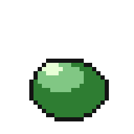
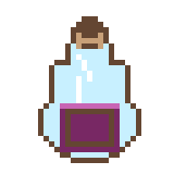
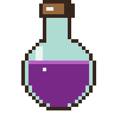
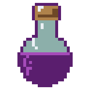

# Showcase — different models, one studio

Everything here was drawn through atelier's MCP tools by the model named on
it, from a fixed text brief — no retries, no cherry-picking, no human
touch-ups. The studio carries the discipline (lock a palette → draw → *look*
→ audit → fix), so every run ships on-palette, orphan-free, looping art;
what changes between models is the hand. New models slot straight in: give
one the same brief and add a column.

## The pieces

| Campfire — Haiku 4.5 | Coin — Sonnet 5 | Invader — Opus 4.8 | Slime — Fable 5 |
|:---:|:---:|:---:|:---:|
|  |  |  |  |
| flame flicker, drifting embers | spin about the vertical axis | march with a blink | squash-and-stretch bounce |

## Same brief, every model

One instruction set, verbatim, to each model — the bounce:

| Haiku 4.5 | Sonnet 5 | Opus 4.8 | Fable 5 |
|:---:|:---:|:---:|:---:|
|  |  |  |  |

…and the potion:

| Haiku 4.5 | Sonnet 5 | Opus 4.8 | Fable 5 |
|:---:|:---:|:---:|:---:|
|  |  |  |  |

## Reproduce it

The briefs are plain text (e.g. *"Animate a 4-frame bouncing slime with
squash and stretch: rest → squash → airborne stretch → descend. Lock 4
colours. Look after every burst; fix what reads wrong."*). Point any
MCP-capable model at atelier, hand it the brief, and it draws with the same
tools — `doc_look` to see, the audits to verify, `doc_export` to ship.
