# Showcase

Every model below drew the same ten briefs through atelier's
tools, one agent per task, with no human touching the pixels.

**Method.** Subagents driving atelier, one agent per task, each loading the atelier-sprite skill and working only through atelier's tools — the Anthropic models via Claude Code, kimi-k3 via Kimi Code, and gpt-5.6-sol-max via Codex. Every model draws the same ten tasks from identical frozen briefs (benchmarks/tasks/*.txt). Stats: Claude Code runs report the client's own tool_uses and subagent tokens plus each agent's self-reported doc_look count; Kimi Code and Codex runs report each agent's self-reported tool-call and doc_look tally (per-agent token usage is unavailable, so tokens are null). Durations are omitted: agents ran concurrently, so wall-clock is queueing, not work.

**Server.** The original 50 runs used atelier 1.5.0+ (28-tool surface) against one long-running daemon build (master, pre-#51). The 10 gpt-5.6-sol-max runs used atelier 1.7.0 through isolated in-process CLI dispatch on master. The 10 opus-5 runs used atelier 1.9.0 (25-tool surface) through isolated CLI dispatch, one store per task, which is also the build this site now pins. Atelier 1.9.0 requires 32-bit integers where earlier builds silently accepted fractions, so two pre-existing replays (gpt-5.6-sol-max/slash, haiku-4.5/ball) had 5 and 11 fractional arguments rounded to integers and their GIFs regenerated; the calls are otherwise the models' own. Each changed under 1% of that animation's pixels.

**Verified.** Every GIF parsed from disk: all 70 are 10 frames x 100ms = 1000ms, 32x32 (48x48 for beam) at scale 4, with the requested palette cardinality and transparency. CI replays all 70 committed JSONL files through the pinned binary and requires the exported GIFs to match byte-for-byte.

Each GIF is reproducible from the replay beside it:

```sh
atelier replay showcase/replays/<model>/<task>.jsonl --home /tmp/demo
```

## alien

> Creature — a big-headed green alien idling: it hovers, antennae sway, one blink.
> Symmetric and centered. Loops seamlessly. 10 frames, 1 second at 10 FPS. 32x32 canvas.
> 4 colours, transparent background.

| haiku-4.5 | sonnet-5 | opus-4.8 | fable-5 | kimi-k3 | gpt-5.6-sol-max | opus-5 |
|---|---|---|---|---|---|---|
| 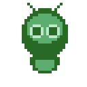 | 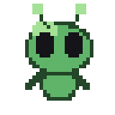 | 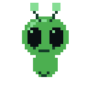 | 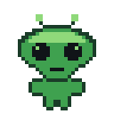 | 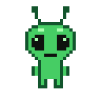 |  | 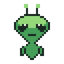 |
| 63 calls<br>3 looks<br>54,205 tokens | 88 calls<br>3 looks<br>92,909 tokens | 62 calls<br>5 looks<br>91,970 tokens | 55 calls<br>3 looks<br>76,602 tokens | 39 calls<br>3 looks<br>n/a tokens | 66 calls<br>5 looks<br>n/a tokens | 33 calls<br>5 looks<br>111,729 tokens |

## ball

> Prop — a rubber ball: falls, squashes flat on contact, rebounds tall, and rises —
> squash & stretch with a scaling cast shadow. Loops seamlessly. 10 frames, 1 second
> at 10 FPS. 32x32 canvas. 4 colours, transparent background.

| haiku-4.5 | sonnet-5 | opus-4.8 | fable-5 | kimi-k3 | gpt-5.6-sol-max | opus-5 |
|---|---|---|---|---|---|---|
| 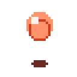 | 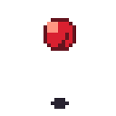 | 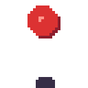 | 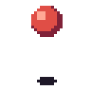 | 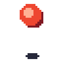 | 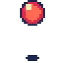 | 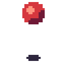 |
| 49 calls<br>6 looks<br>49,786 tokens | 71 calls<br>3 looks<br>85,130 tokens | 56 calls<br>2 looks<br>77,789 tokens | 54 calls<br>2 looks<br>68,817 tokens | 34 calls<br>2 looks<br>n/a tokens | 45 calls<br>3 looks<br>n/a tokens | 61 calls<br>34 looks<br>104,543 tokens |

## beam

> Effect — a character seen in profile firing an energy beam from cupped hands:
> gather with a charging orb at the hands, release, the beam lances out to the right
> as the body recoils, then it fades and the pose settles. Loops seamlessly. 10
> frames, 1 second at 10 FPS. 48x48 canvas. 6 colours, transparent background.

| haiku-4.5 | sonnet-5 | opus-4.8 | fable-5 | kimi-k3 | gpt-5.6-sol-max | opus-5 |
|---|---|---|---|---|---|---|
| 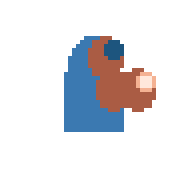 | 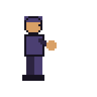 | 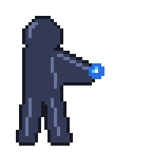 | 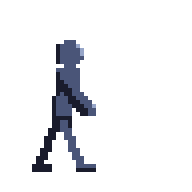 | 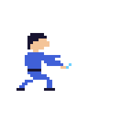 | 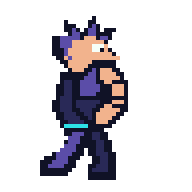 | 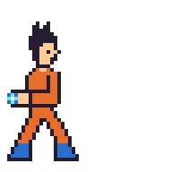 |
| 53 calls<br>3 looks<br>50,851 tokens | 53 calls<br>4 looks<br>80,375 tokens | 49 calls<br>3 looks<br>77,010 tokens | 82 calls<br>6 looks<br>102,543 tokens | 33 calls<br>4 looks<br>n/a tokens | 51 calls<br>4 looks<br>n/a tokens | 49 calls<br>8 looks<br>138,204 tokens |

## car

> Vehicle — a side-view car driving in place: wheels spin, the body bobs on its
> suspension, a small exhaust puff, speed lines streak past. Loops seamlessly.
> 10 frames, 1 second at 10 FPS. 32x32 canvas. 6 colours, transparent background.

| haiku-4.5 | sonnet-5 | opus-4.8 | fable-5 | kimi-k3 | gpt-5.6-sol-max | opus-5 |
|---|---|---|---|---|---|---|
|  | 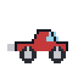 | 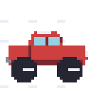 | 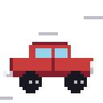 | 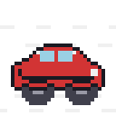 | 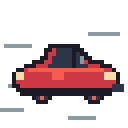 | 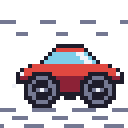 |
| 66 calls<br>4 looks<br>71,242 tokens | 58 calls<br>2 looks<br>87,236 tokens | 84 calls<br>3 looks<br>94,500 tokens | 76 calls<br>3 looks<br>79,945 tokens | 49 calls<br>5 looks<br>n/a tokens | 63 calls<br>7 looks<br>n/a tokens | 47 calls<br>16 looks<br>121,096 tokens |

## cat

> Animal — a cat in a wizard hat with a glowing staff orb that pulses and casts
> light, tail swaying, sparkles drifting up. Loops seamlessly. 10 frames, 1 second
> at 10 FPS. 32x32 canvas. 6 colours, transparent background.

| haiku-4.5 | sonnet-5 | opus-4.8 | fable-5 | kimi-k3 | gpt-5.6-sol-max | opus-5 |
|---|---|---|---|---|---|---|
| 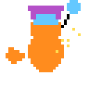 |  | 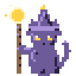 | 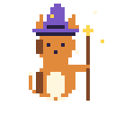 | 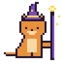 | 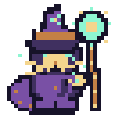 | 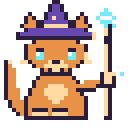 |
| 64 calls<br>2 looks<br>73,615 tokens | 115 calls<br>6 looks<br>140,571 tokens | 79 calls<br>3 looks<br>89,721 tokens | 83 calls<br>3 looks<br>85,661 tokens | 38 calls<br>2 looks<br>n/a tokens | 42 calls<br>4 looks<br>n/a tokens | 50 calls<br>9 looks<br>144,998 tokens |

## explosion

> Effect — a particle explosion: a bright core flashes, throws debris and sparks
> outward on arcing paths, they fade as they fly, and a puff of smoke curls up and
> dissipates to nothing. Reads as force. Loops seamlessly. 10 frames, 1 second at
> 10 FPS. 32x32 canvas. 6 colours, transparent background.

| haiku-4.5 | sonnet-5 | opus-4.8 | fable-5 | kimi-k3 | gpt-5.6-sol-max | opus-5 |
|---|---|---|---|---|---|---|
| 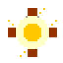 | 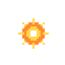 |  | 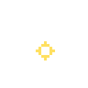 | 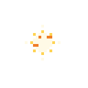 |  | 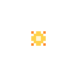 |
| 68 calls<br>4 looks<br>62,137 tokens | 57 calls<br>7 looks<br>84,500 tokens | 49 calls<br>3 looks<br>68,110 tokens | 48 calls<br>6 looks<br>65,646 tokens | 36 calls<br>9 looks<br>n/a tokens | 51 calls<br>10 looks<br>n/a tokens | 48 calls<br>47 looks<br>120,836 tokens |

## person

> Character — a front-facing human adventurer jumping: crouch, launch, airborne with
> arms up and legs tucked, fall, then land absorbing the impact. Faces the viewer
> throughout. Weight reads through the whole body. Loops seamlessly. 10 frames,
> 1 second at 10 FPS. 32x32 canvas. 6 colours, transparent background.

| haiku-4.5 | sonnet-5 | opus-4.8 | fable-5 | kimi-k3 | gpt-5.6-sol-max | opus-5 |
|---|---|---|---|---|---|---|
| 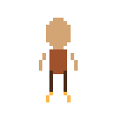 | 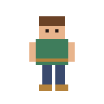 | 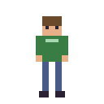 | 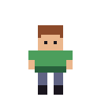 | 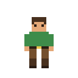 | 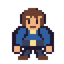 | 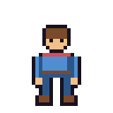 |
| 82 calls<br>3 looks<br>85,127 tokens | 89 calls<br>2 looks<br>98,958 tokens | 33 calls<br>3 looks<br>67,559 tokens | 76 calls<br>6 looks<br>82,198 tokens | 50 calls<br>9 looks<br>n/a tokens | 62 calls<br>6 looks<br>n/a tokens | 43 calls<br>7 looks<br>113,512 tokens |

## potion

> Item — a corked flask, two-thirds full: bubbles rise through the liquid and pop at
> a wobbling surface while the bottle stays still. Loops seamlessly. 10 frames,
> 1 second at 10 FPS. 32x32 canvas. 6 colours, transparent background.

| haiku-4.5 | sonnet-5 | opus-4.8 | fable-5 | kimi-k3 | gpt-5.6-sol-max | opus-5 |
|---|---|---|---|---|---|---|
|  | 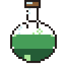 | 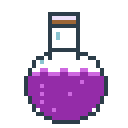 | 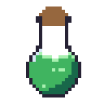 |  | 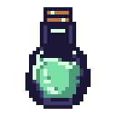 |  |
| 58 calls<br>8 looks<br>56,624 tokens | 125 calls<br>4 looks<br>126,592 tokens | 55 calls<br>4 looks<br>83,419 tokens | 66 calls<br>3 looks<br>93,681 tokens | 38 calls<br>4 looks<br>n/a tokens | 50 calls<br>6 looks<br>n/a tokens | 51 calls<br>24 looks<br>101,757 tokens |

## slash

> Effect — a sword slash arc: a bright crescent sweeps down-right across the frame,
> peaks with a hot leading edge and a hard impact flash, then thins and fades to
> nothing. Reads as motion with no character present. Loops seamlessly. 10 frames,
> 1 second at 10 FPS. 32x32 canvas. 6 colours, transparent background.

| haiku-4.5 | sonnet-5 | opus-4.8 | fable-5 | kimi-k3 | gpt-5.6-sol-max | opus-5 |
|---|---|---|---|---|---|---|
| 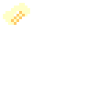 |  | 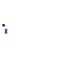 |  |  |  |  |
| 48 calls<br>4 looks<br>68,593 tokens | 67 calls<br>4 looks<br>86,938 tokens | 51 calls<br>5 looks<br>85,473 tokens | 51 calls<br>6 looks<br>70,833 tokens | 36 calls<br>11 looks<br>n/a tokens | 35 calls<br>4 looks<br>n/a tokens | 55 calls<br>12 looks<br>102,161 tokens |

## torch

> Environment — a wall-mounted torch: the flame flickers and licks upward, embers
> drift up and fade, a soft light pulse on the bracket. Loops seamlessly. 10 frames,
> 1 second at 10 FPS. 32x32 canvas. 5 colours, transparent background.

| haiku-4.5 | sonnet-5 | opus-4.8 | fable-5 | kimi-k3 | gpt-5.6-sol-max | opus-5 |
|---|---|---|---|---|---|---|
|  |  |  |  |  |  |  |
| 46 calls<br>3 looks<br>48,004 tokens | 88 calls<br>3 looks<br>122,338 tokens | 61 calls<br>4 looks<br>83,240 tokens | 63 calls<br>3 looks<br>76,229 tokens | 54 calls<br>5 looks<br>n/a tokens | 58 calls<br>3 looks<br>n/a tokens | 38 calls<br>7 looks<br>91,949 tokens |

---

Generated by `tools/build-showcase.py` from `showcase/runs.json`.
